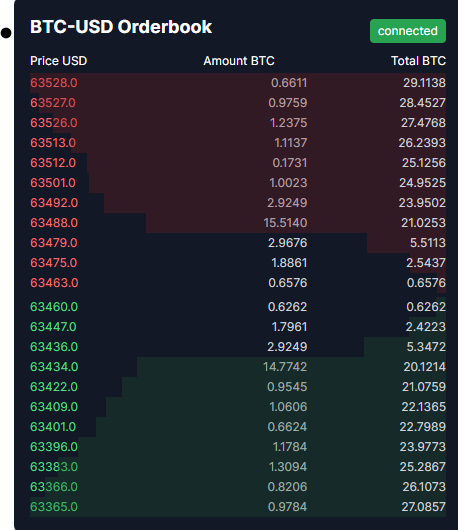

# Real-Time Orderbook Component

## Screenshots



## Description

This project implements a real-time orderbook component for cryptocurrency trading using React, TypeScript, and the Centrifuge WebSocket library. The orderbook displays live bid and ask orders for a specified trading pair, updating in real-time as market data changes.

Key features:

- Real-time updates of bid and ask orders
- Visual representation of order volumes
- Connection status indicator
- Automatic reconnection on network disruptions
- Support for multiple trading pairs

Demo URL: https://einar-order-book.vercel.app/

## Challenges

During the development of this project, we encountered several challenges:

1. **WebSocket Connection Management**: Ensuring stable WebSocket connections and handling reconnections gracefully.
2. **Data Synchronization**: Keeping the orderbook data synchronized with the server, especially after connection interruptions.
3. **Performance Optimization**: Efficiently updating the UI with frequent data changes without causing excessive re-renders.
4. **Subscription Handling**: Managing WebSocket subscriptions correctly, particularly when changing trading pairs.

## Solutions

To address these challenges, we implemented the following solutions:

1. **Robust Connection Handling**: Implemented a connection management system with automatic reconnection using exponential backoff.
2. **Sequence-Based Updates**: Used sequence numbers to ensure data consistency and handle out-of-order messages.
3. **Optimized Rendering**: Employed React's state management efficiently and used memoization techniques to minimize unnecessary re-renders.
4. **Dynamic Subscription Management**: Developed a system to manage subscriptions dynamically, allowing smooth transitions between different trading pairs.

## Prerequisites

To run and develop this project, you'll need the following:

1. **Node.js**: Version 18.x or higher. You can download it from [nodejs.org](https://nodejs.org/).

2. **npm** or **yarn**: These come with Node.js, but make sure you have a recent version.

3. **React**: This project is built with React 18.x.

4. **TypeScript**: The project uses TypeScript 4.x or higher.

5. **Next.js**: This project is built on Next.js 14.x or higher.

6. **Centrifuge**: We use the Centrifuge library for WebSocket connections.

7. **Tailwind CSS**: For styling, we use Tailwind CSS 3.x.

8. **A modern web browser**: The latest versions of Chrome, Firefox, Safari, or Edge are recommended for development and testing.

9. **Git**: For version control and contributing to the project.

10. **A code editor**: We recommend Visual Studio Code with the following extensions:

    - ESLint
    - Prettier
    - Tailwind CSS IntelliSense

11. **API Access**: You'll need access to the WebSocket API endpoint and a valid JWT token for authentication.

## How to run this project

To run this project, follow these steps:

### Clone the repository:

```
git clone https://github.com/your-repo/orderbook-component.git
cd orderbook-component
```

### Install dependencies:

```
npm install
```

### Set up environment variables:

1. Find a file named `env.ts` in the lib folder with the following content:

```
NEXT_PUBLIC_JWT_TOKEN=your_jwt_token_here
NEXT_PUBLIC_WS_ENDPOINT=wss://your-websocket-endpoint.com
```

2. Replace `your_jwt_token_here` and the WebSocket endpoint with your actual values.

### Run the application:

```
npm run dev
```

http://localhost:3000 in your browser to see the result.

## Contributing

Contributions to this project are welcome! Here's how you can contribute:

1. Fork the repository.
2. Create a new branch for your feature or bug fix.
3. Make your changes and commit them with a clear, descriptive commit message.
4. Push your changes to your fork.
5. Submit a pull request to the main repository.
6. Please ensure your code adheres to the existing style and include appropriate tests if applicable.
